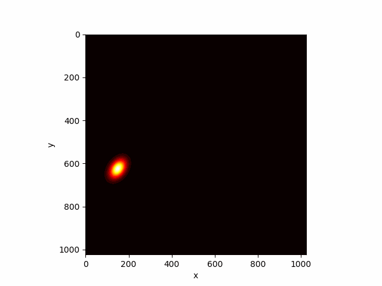

# Semantiva Imaging

## Overview

**Semantiva Imaging** is a comprehensive image processing extension for the Semantiva framework that provides production-ready tools for computer vision and scientific imaging workflows. Built with type safety and pipeline composability at its core, it offers seamless integration with industry-standard libraries like OpenCV while maintaining transparent, auditable processing chains.

The extension delivers enterprise-grade capabilities including multi-format I/O, OpenCV integration, N-channel image support, and advanced factory patterns for rapid processor development—all within Semantiva's dual-channel architecture that processes data and metadata simultaneously.

**Links:**
- [Semantiva Imaging Repository](https://github.com/semantiva/semantiva-imaging)
- [Semantiva Framework](https://github.com/semantiva/semantiva)

---

## Features

### OpenCV Integration
- **Factory-Generated Processors**: Automatically generates OpenCV-based processors using the `_create_opencv_processor` factory
- **Smart Channel Conversion**: Handles BGR/RGB channel reordering transparently for OpenCV functions  
- **Signature Synthesis**: Dynamically creates processors from OpenCV function signatures with proper parameter mapping
- **Tuple Return Handling**: Manages complex OpenCV return types with automatic unpacking and conversion

### Comprehensive Data Types
- **Single Channel**: `SingleChannelImage` for 2D grayscale images and `SingleChannelImageStack` for 3D stacks
- **Multi-Channel**: `RGBImage`, `RGBAImage`, and generic `NChannelImage` with customizable channel metadata
- **Stack Support**: All image types available as stack variants for temporal or Z-axis data
- **Smart Casting**: Auto-cast 12-/16-bit arrays to `float32` by default (disable with `auto_cast=False`)

### Multi-Format I/O
- **Standard Formats**: PNG, JPEG, TIFF, NPZ with dedicated loader/saver classes
- **Video Support**: AVI video loading and saving with `VideoRGBImageStackLoader` and `VideoRGBImageStackSaver`
- **Animated Media**: Animated GIF support for both single-channel and RGBA image stacks
- **Network Loading**: HTTP/HTTPS image loading via `UrlLoader` factory pattern
- **Parametric Generation**: Synthetic image generation with `TwoDGaussianSingleChannelImageGenerator`

### Advanced Processing
- **Factory Systems**: `_create_nchannel_processor` and `_create_opencv_processor` for dynamic processor generation
- **Built-in Operations**: Image arithmetic, filtering, normalization, cropping, and stack projections
- **Scientific Analysis**: Gaussian fitting probes including `TwoDGaussianFitterProbe` and `TwoDTiltedGaussianFitterProbe`
- **Pre-built OpenCV Processors**: Ready-to-use filters, edge detection, and morphological operations

### Interactive Visualization
- **Cross-Section Viewer**: Dynamic exploration of 2D image cross-sections (`ImageCrossSectionInteractiveViewer`)
- **Stack Animation**: Animate image sequences with `SingleChannelImageStackAnimator`
- **Projection Views**: X-Y intensity projections with `ImageXYProjectionViewer`
- **Standard Display**: Both static and interactive image viewers for Jupyter notebook integration

### Pipeline Integration
- **Seamless Workflow**: Full integration with Semantiva's YAML-based pipeline system
- **Context-Aware Processing**: Metadata flows alongside data for parameter-driven operations
- **Modular Design**: Mix and match processors in complex multi-stage workflows

---

## Installation
```bash
pip install semantiva semantiva-imaging
```

## Quick Start: Parametric Image Generation Pipeline

Semantiva Imaging demonstrates advanced capabilities through parametric workflows that generate synthetic data, extract features, and perform model fitting—all within a unified pipeline architecture.

The following example generates a time-varying 2D Gaussian signal with parametric position, standard deviation, and orientation changes:



**Run the complete pipeline:**
```bash
semantiva run tests/pipeline_parametric_gaussian_fit.yaml -v
```

**Pipeline highlights:**
- **Parametric Generation**: Creates image stacks using symbolic expressions for signal parameters
- **Feature Extraction**: Extracts Gaussian parameters from each frame using `TwoDTiltedGaussianFitterProbe`
- **Model Fitting**: Fits polynomial models to temporal parameter evolution
- **Context Flow**: Metadata and parameters flow seamlessly alongside image data

This demonstrates Semantiva's dual-channel processing where data and metadata evolve together, enabling dynamic, parameter-driven workflows ideal for research and production environments.

---

### Codec-Dependent Classes

Some loader/saver classes in Semantiva Imaging depend on system-specific codecs, which may not be available or consistent across all environments. For detailed information about dependencies, risks, and recommendations, please refer to the [Codec Dependencies Documentation](./codec_dependencies.md).

## License

Semantiva-imaging is released under the [Apache License 2.0](./LICENSE).
